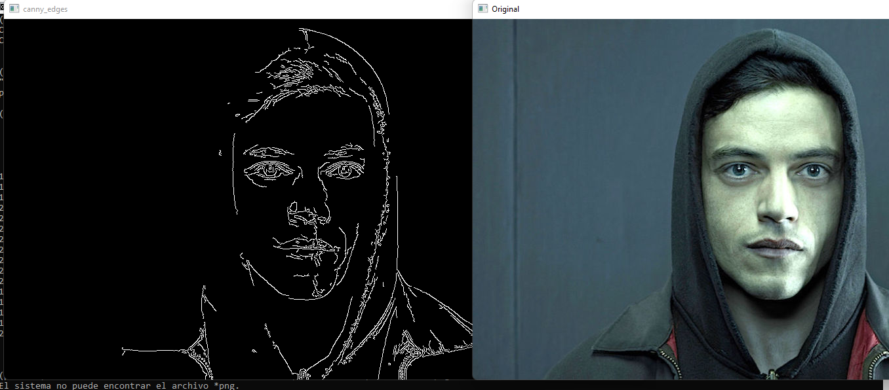
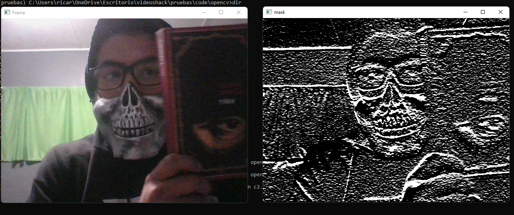
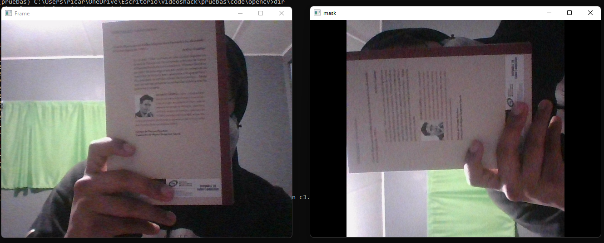
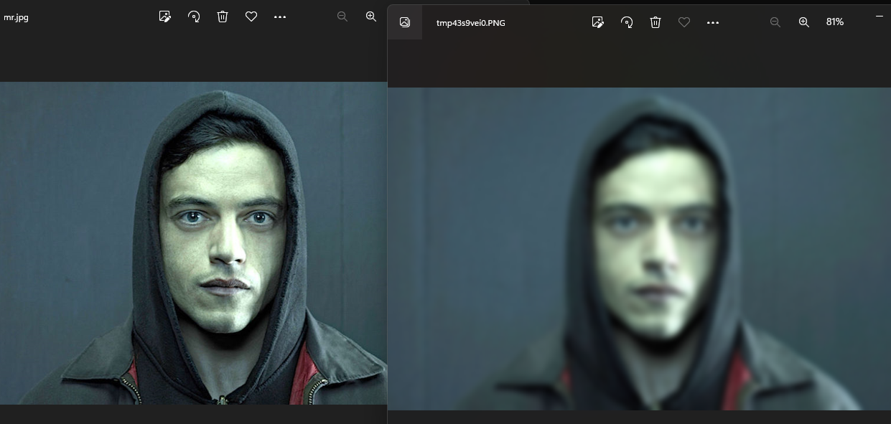
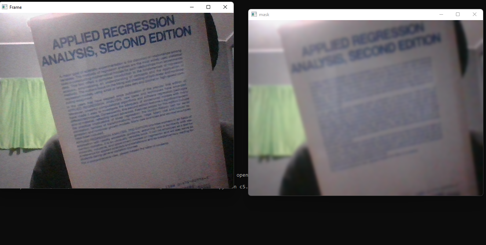
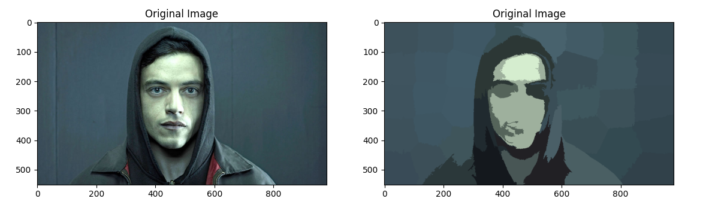
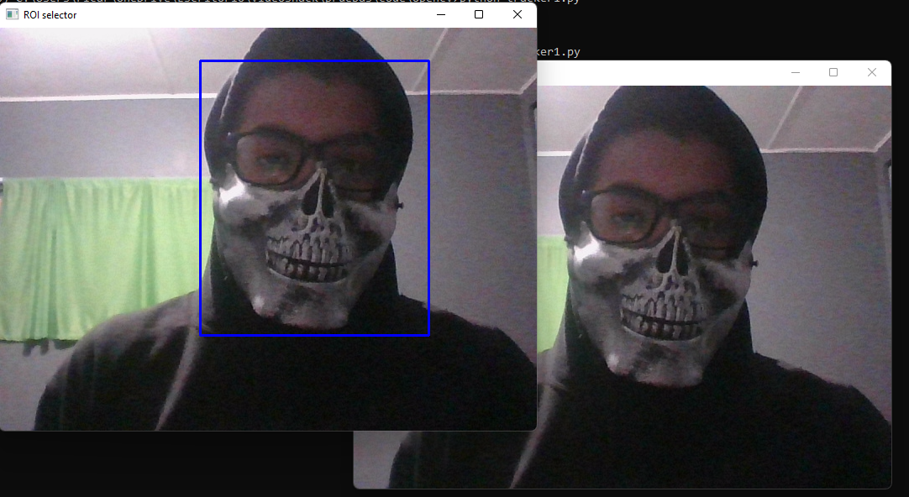
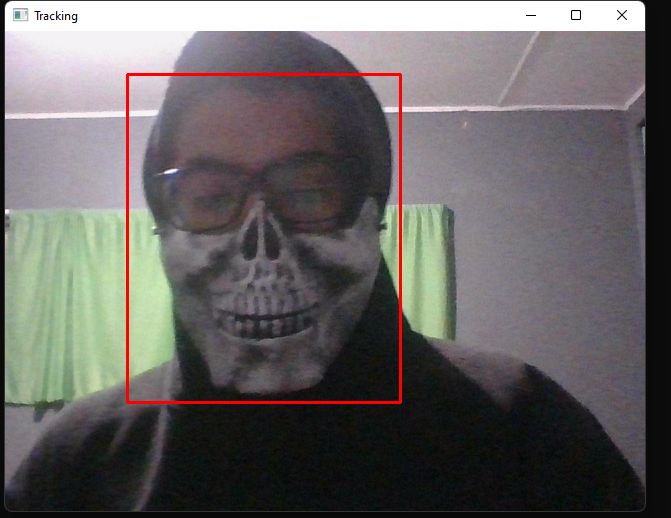

# Opencv and python3

## Im using python 3.10.9
### python -V
### Python==3.10.9

## Packages
## pip list
### numpy==1.24.0
### opencv-contrib-python==4.6.0.66
### opencv-python==4.6.0.66
### matplotlib==3.6.2
### scikit-image==0.19.3
### pip==22.3.1

## How to create a virtual environment in python
### https://www.freecodecamp.org/news/how-to-setup-virtual-environments-in-python/

## windows
### pip install virtualenv
### python<version> -m venv <virtual-environment-name>
## Example:
### mkdir projectA
### cd projectA
### python3.8 -m venv env
## Activate
### env/Scripts/activate.bat //In CMD
### env/Scripts/Activate.ps1 //In Powershel
## Deactivate
### deactivate

## Linux
### pip install virtualenv
### python<version> -m venv <virtual-environment-name>
## Example:
### mkdir projectA
### cd projectA
### python3.8 -m venv env
## Activate
### source env/bin/activate
## Deactivate
### deactivate

##Commands to verify you are inside a virtual env
### pip list
### pip -V
## python -V

## How to create requirements.txt of your project
### pip freeze > requirements.txt

## How to install the libraries you used in the project
### https://note.nkmk.me/en/python-pip-install-requirements/
### pip install -r requirements.txt

## How to install package(library) by hand
### pip install package

  
  
# Evidence
  
  ## c.py
  
  
  ## c1.py
  
  
  ## c2.py
  
  
  ## c3.py
  
  ## c4.py
  
  
  ## c5.py
  
  ## c8.py
  
  
  ## tracker1.py
  
  
